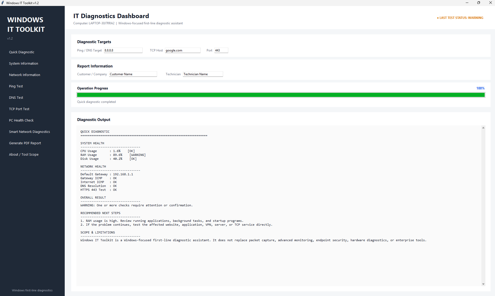

# Windows IT Toolkit

Windows IT Toolkit is a Windows-focused first-line diagnostic assistant designed for IT technicians, system administrators, help desk staff, and technical support environments.

It brings common Windows system and network checks together in a simple graphical interface, helping technicians perform initial troubleshooting and generate professional PDF health reports.

> Windows IT Toolkit is a first-line diagnostic assistant. It is not intended to replace advanced network monitoring, packet capture, vulnerability assessment, endpoint security, or enterprise management platforms.

## Features

- Quick Diagnostic
- System Information
- Network Information
- Ping Test
- DNS Test
- TCP Port Test
- PC Health Check
- Smart Network Diagnostics
- Professional PDF IT Health Reports
- Customer / Company information
- Technician information
- Automatic diagnostic recommendations
- Operation progress tracking

## Quick Diagnostic

Quick Diagnostic performs several first-line checks in a single workflow.

It checks:

- CPU usage
- RAM usage
- Disk usage
- Default gateway
- Gateway ICMP reachability
- Internet ICMP reachability
- DNS resolution
- HTTPS TCP/443 connectivity

The results are combined into an overall status:

- OK
- WARNING
- CRITICAL

The application also provides recommended next steps when a potential problem is detected.

## Operation Progress Tracking

Windows IT Toolkit v1.2 includes visual progress tracking.

When a diagnostic operation is running, the interface displays:

- Current operation
- Current diagnostic stage
- Progress bar
- Completion percentage
- Success or failure status

This provides clear feedback during operations such as Quick Diagnostic, Ping Test, Network Diagnostics, PC Health Check, and PDF report generation.

## PC Health Check

The PC Health Check evaluates:

- CPU usage
- RAM usage
- Available memory
- Disk usage
- Available disk space

Results are automatically classified as OK, WARNING, or CRITICAL.

## Network Diagnostics

The toolkit can perform several basic network connectivity checks:

- Default gateway detection
- Gateway ICMP test
- Internet ICMP test
- DNS resolution
- TCP port connectivity
- HTTPS TCP/443 connectivity

Smart Network Diagnostics analyzes the results and provides first-line troubleshooting recommendations.

### ICMP Note

A failed ping does not always mean that a host or Internet connection is unavailable.

ICMP traffic may be blocked by a firewall, router, ISP, server, or network policy. For this reason, Windows IT Toolkit also uses TCP connectivity checks where appropriate.

## TCP Port Test

The TCP Port Test allows a technician to test connectivity to a specific host and TCP port.

Examples include:

- 22 - SSH
- 80 - HTTP
- 443 - HTTPS
- 445 - SMB
- 3389 - RDP

This feature is intended for targeted connectivity diagnostics. It is not a port scanner.

## PDF IT Health Reports

Windows IT Toolkit can generate professional PDF diagnostic reports containing:

- Customer / Company
- Technician
- Report ID
- Report date
- Computer information
- Windows version
- System health
- Network health
- Executive summary
- Recommendations
- Overall health status
- Scope and limitations

Reports can be used to document first-line diagnostic findings for customers, internal IT teams, or support records.

## Screenshot



## Scope and Limitations

Windows IT Toolkit is designed for first-line Windows troubleshooting.

It does not replace specialized tools for:

- Packet capture and protocol analysis
- Vulnerability assessment
- Endpoint detection and response
- Hardware diagnostics
- Enterprise monitoring
- Advanced server monitoring
- Network performance analysis

The purpose of the toolkit is to quickly collect common diagnostic information and help technicians decide what should be investigated next.

## Requirements

To run from source:

- Windows 10 or Windows 11
- Python 3
- psutil
- ReportLab

Install dependencies:

```cmd
pip install psutil reportlab